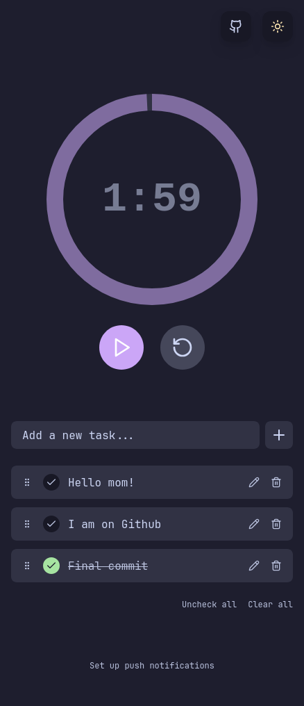

# Productivy Clock

A modern, minimalist productivity timer and task manager built with React, TypeScript, and Tailwind CSS, featuring the beautiful Catppuccin color scheme.

🚀 **[Try it out here!](https://timer.vivacityholding.com)** ✨

 

## Features

- 🕒 Customizable Pomodoro-style timer
- ✅ Task management with drag-and-drop reordering
- 🌓 Light/Dark mode with Catppuccin theme
- 🎯 Push notifications via NTFY
- 🎉 Celebration animations on task completion
- 📲 Responsive design and Progressive Web App (PWA) support
- 💾 Persistent state across page reloads and browser restarts

## Tech Stack

- React 18
- TypeScript
- Tailwind CSS
- Vite
- dnd-kit (drag and drop)
- Lucide React (icons)
- Headless UI (accessible components)
- NTFY (push notifications)

## Getting Started

### Prerequisites

- Node.js (v14 or higher)
- npm or yarn
- NTFY app (optional, for push notifications)

### Installation

1. Clone the repository:
```bash
git clone https://github.com/lperez37/productivy-clock.git
cd productivy-clock
```

2. Install dependencies:
```bash
npm install
# or
yarn install
```

3. Start the development server:
```bash
npm run dev
# or
yarn dev
```

4. Open [http://localhost:5173](http://localhost:5173) in your browser.

## Usage

### Timer
- Set your desired time using the input field
- Start/pause the timer using the play/pause button
- Reset the timer using the reset button
- Get an extra 5 minutes up to 3 times when the timer is up

### Tasks
- Add tasks using the input field
- Mark tasks as complete by clicking the checkbox
- Edit tasks by clicking the pencil icon
- Delete tasks using the trash icon
- Reorder tasks by dragging the grip handle

### Push Notifications
- Click "Set up push notifications" at the bottom of the page
- Choose between default NTFY server (ntfy.sh) or a custom server
- Enter a unique topic for your notifications
- Optionally customize the notification message
- Install the NTFY app from [ntfy.sh](https://ntfy.sh/) on your devices
- Subscribe to your topic in the NTFY app to receive notifications

## Customization

The app uses the Catppuccin color scheme, which can be customized in `src/index.css`. The theme includes both light (Latte) and dark (Mocha) variants.

## Contributing

Contributions are welcome! Please feel free to submit a Pull Request.

## License

This project is licensed under the MIT License - see the [LICENSE](LICENSE) file for details.

## Acknowledgments

- [Catppuccin](https://github.com/catppuccin/catppuccin) for the beautiful color scheme
- [Lucide](https://lucide.dev/) for the icons
- [dnd kit](https://dndkit.com/) for drag and drop functionality
- [NTFY](https://ntfy.sh/) for the push notification service 